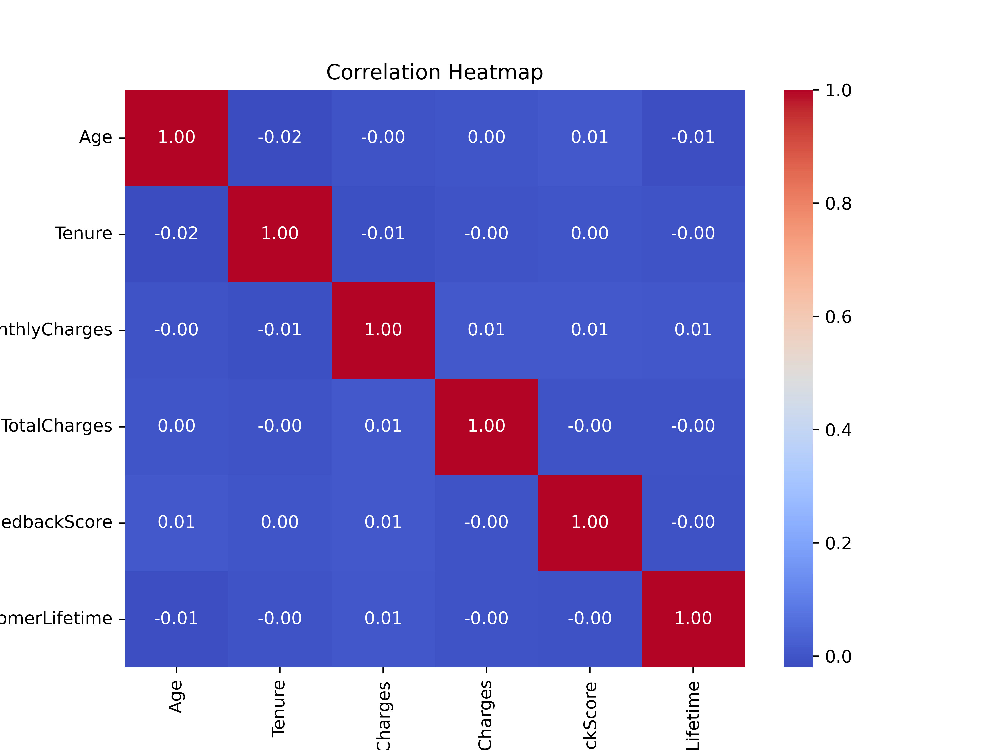
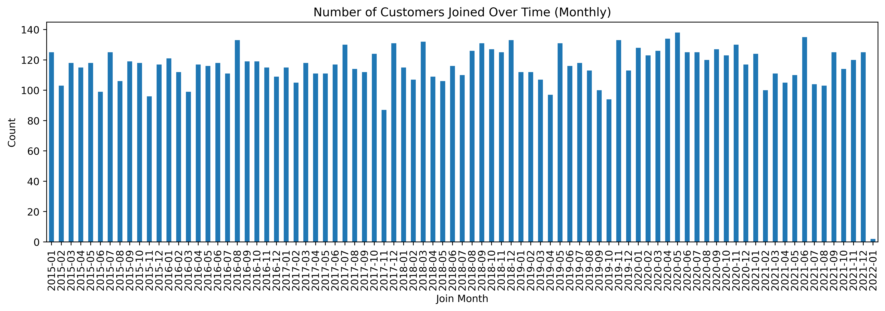
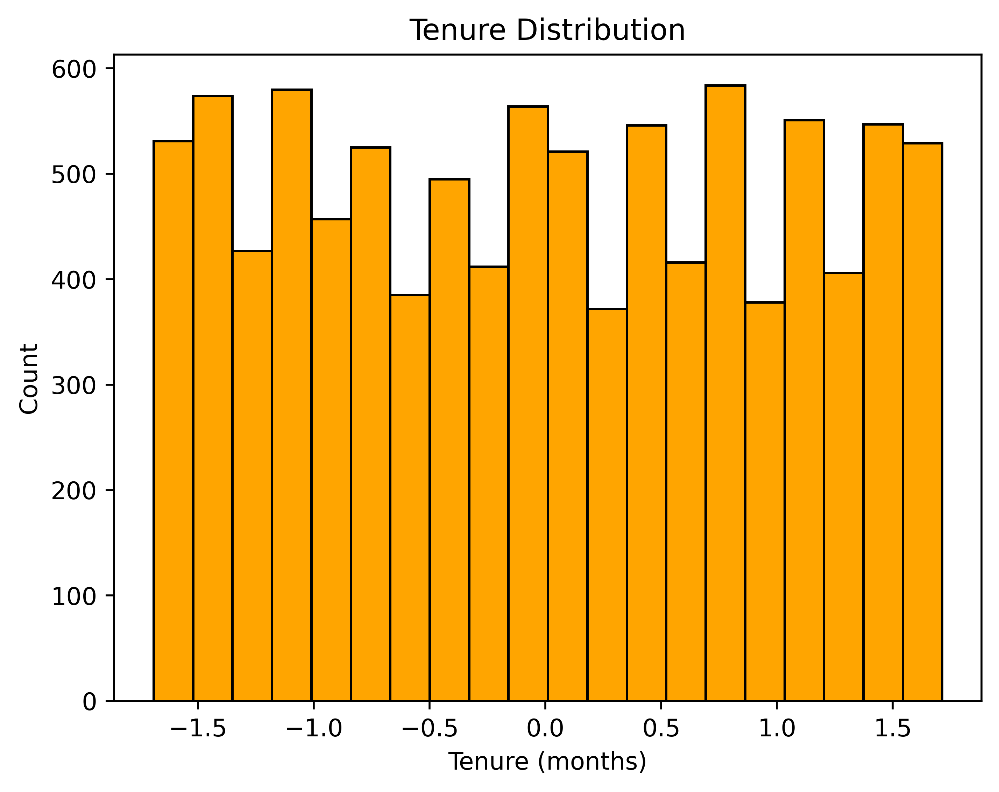
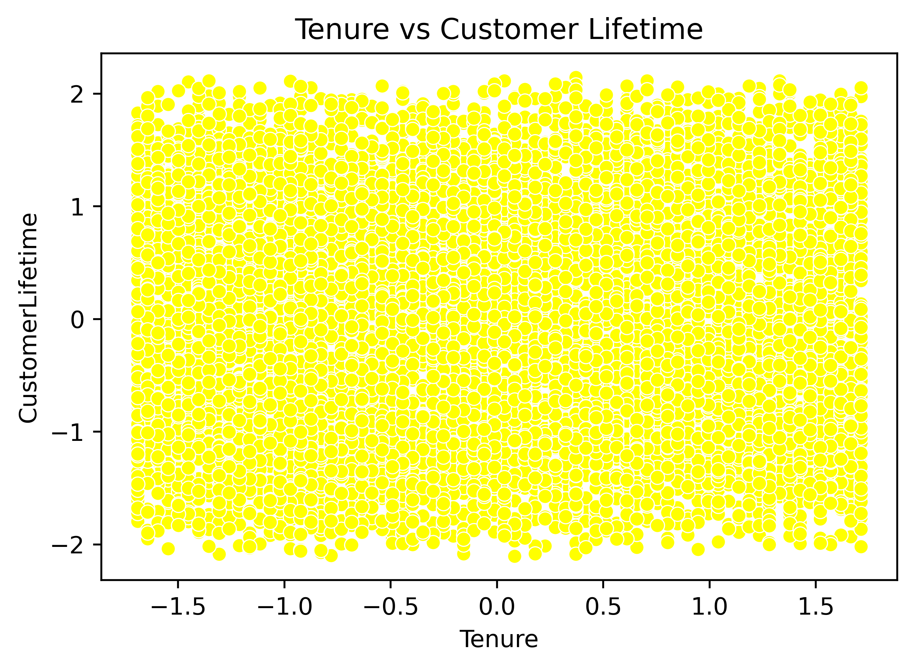
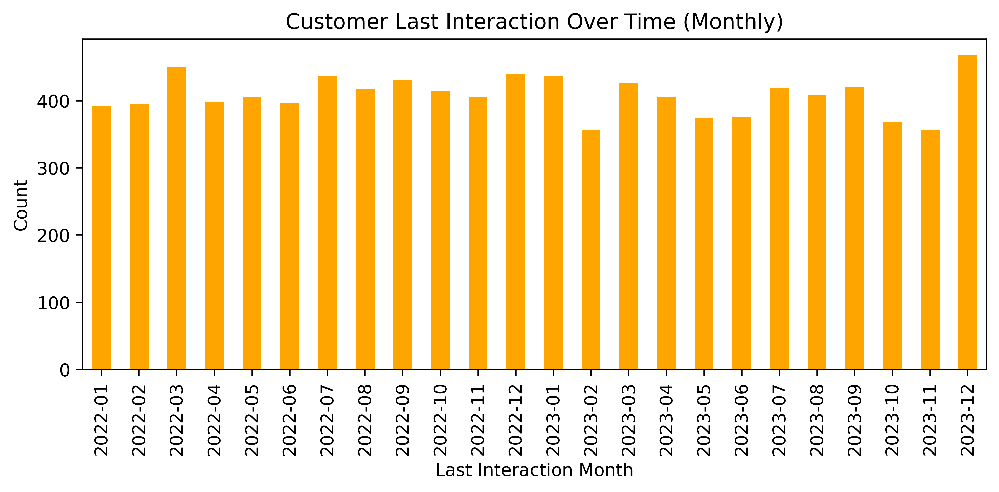
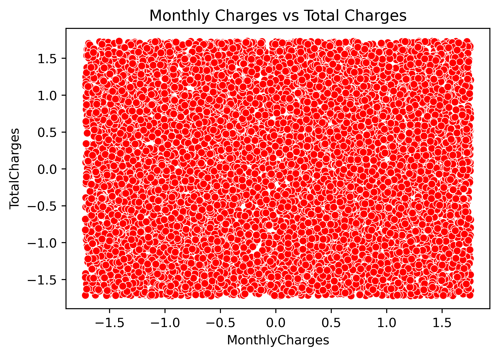
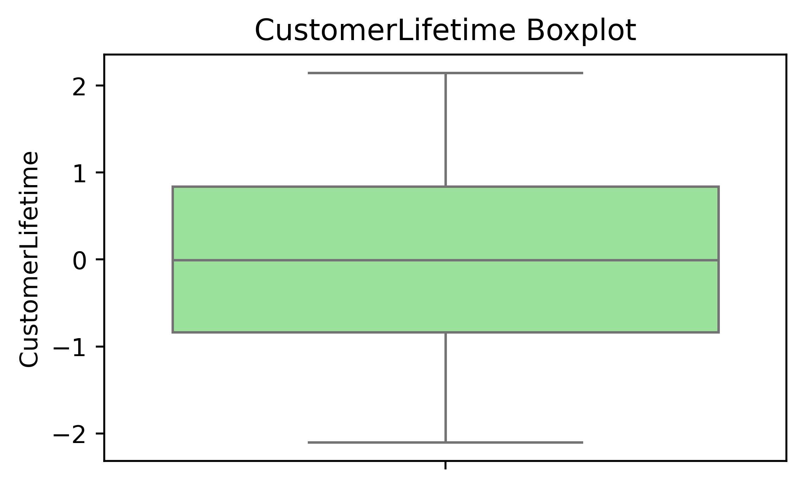

# AI-Powered Churn Prevention Advisor & Bias Detection Suite

## Project Overview

End-to-end solution covering **churn prevention**, **bias detection**,
and **job matching**, integrating data science workflows from EDA to
deployment. Designed to showcase a full-stack data science pipeline with
business-oriented insights and tools.

## Week 1: Churn Advisor (EDA + Preprocessing)

-   Conducted comprehensive exploratory data analysis.
-   Preprocessed raw datasets (missing value handling, encoding,
    scaling).
-   Generated actionable insights through visualizations.

### Key Visualizations

1.  **Correlation Heatmap**\
    
2.  **Customer Join Trend**\
    
3.  **Tenure and Lifetime Distribution**\
    \
    
4.  **Last Interactions Trend**\
    
5.  **Charges and Revenue Analysis**\
    
6.  **Pairwise Relationships**\
    
7.  **Lifetime Value Distribution**\
    

## Week 2: Churn Advisor (Model Training & Evaluation)

-   Built baseline predictive models for churn detection.
-   Performed feature selection and model tuning.
-   Evaluated models using metrics such as accuracy, precision, recall,
    F1-score, and ROC-AUC.

## Week 3: Bias Detector & Job Matcher (Data Prep + Baseline Model)

-   Collected and prepared data for bias detection and job matching.
-   Established baseline models to identify bias in datasets and
    recommend job matches.
-   Designed feature engineering strategies for fair and relevant
    predictions.

## Week 4: Deploy Bias Detector (API + Streamlit UI)

-   Developed RESTful API endpoints to serve bias detection models.
-   Built an interactive **Streamlit UI** for visualization and user
    interaction.
-   Prepared deployment-ready architecture for cloud or on-premise use.

## Tools & Technologies

-   **Languages:** Python\
-   **Libraries:** Pandas, NumPy, Matplotlib, Seaborn, Scikit-learn,
    Streamlit, Flask/FastAPI\
-   **Platform:** Jupyter Notebook, Streamlit UI

## Outcomes

-   Delivered feature-rich datasets and predictive models for churn
    detection.
-   Built a bias detection pipeline with deployment-ready components.
-   Created prototypes for job matching using ML techniques.

## Future Scope

-   Enhance churn prediction with advanced ML (XGBoost, Neural
    Networks).
-   Expand bias detection to support multi-domain fairness auditing.
-   Deploy complete solutions with CI/CD pipelines and monitoring
    dashboards.
